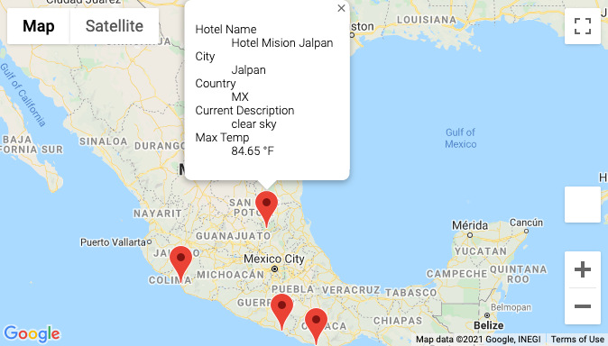

# WeatherPy

## Overview
The PlanMyTrip app wants to answer the question: How might we provide real-time suggestions for our user's ideal hotels? The term ideal is defined by hotels within a given range of latitude and longitude and that provided the perfect kind of weather for the user. 
 
After creating a data frame of 2,000 random latitude and longitude points, an input statement is used to filter the data for the user's weather preferences, which is used to identify potential travel destinations and nearby hotels. From the list of potential travel destinations, the user can choose four cities to create a travel itinerary. Finally, using the Google Maps Directions API, the user can create a travel route and marker layer map between the four cities.

## Results
The Weather Database retrieved:
* Latitude and longitude
* Maximum temperature
* Percent humidity
* Percent cloudiness
* Wind speed
* Weather description (ex: clouds, fog, light rain, clear sky)

The Vacation Database retrieved:
A marker layer map with pop-up markers detailing:
* Hotel name
* City
* Country
* Current weather description with the maximum temperature

The Vacation Itinerary Database retrieved:
* A directions layer map between the cities

* A marker layer map with a pop-up marker for the cities on the itinerary

## Summary
With the enhanced ability to customize and plan a trip based on weather outcomes The PlanMyTrip app will be a must have for any user on their next vacation. 